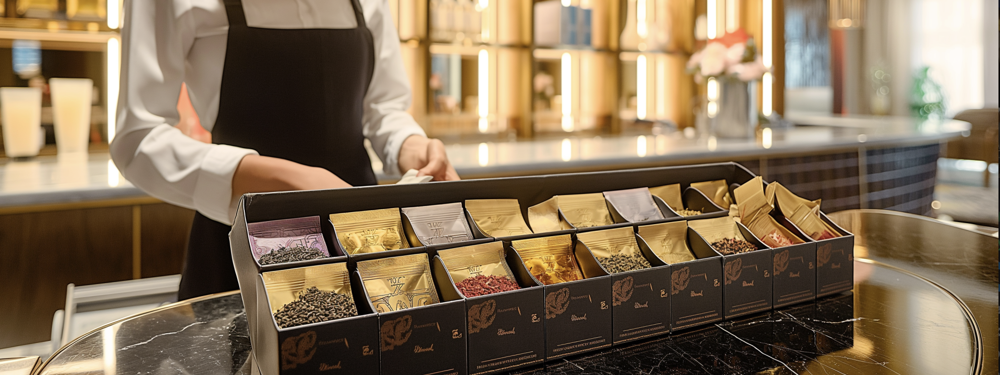

# Tea Cozy Project Repository
Welcome to the Tea Cozy Website Project! 
This project is a beautiful and responsive web page that showcases a fictional tea shop named "The Tea Cozy." The design and layout follow specific requirements provided by Codecademy, ensuring a professional and polished look.

# Project Requirements📋
The project was created based on the following requirements:

A fixed header with navigation links.
A hero section with a background image.
A "Locations" section with three location blocks, each spaced 40px apart.
Each location block has a semi-transparent background.
A footer section with centered content and smaller copyright text aligned to the left.

# Features🌟
Fixed Navigation: The header navigation stays fixed at the top as you scroll.
Beautiful Imagery: High-quality images are used to enhance the visual appeal.
Semantic HTML: Clean and semantic HTML5 code.
CSS Flexbox: Utilizes CSS Flexbox for easy and flexible layout design.

# Project Structure📂
arduino
Code kopieren
/project-folder
│
├── index.html
├── style.css
├── tea-cozy-logo.webp
├── mission-background.webp
├── berryblitz.webp
├── spiced-rum.webp
├── donut.webp
├── myrtle-ave.webp
└── bedford-bizarre.webp

# Final Output🖥️

# Acknowledgements 👏 
This project was built as part of the Codecademy curriculum, following their guidelines and design requirements. Thanks to Codecademy for providing such an engaging and educational experience!
